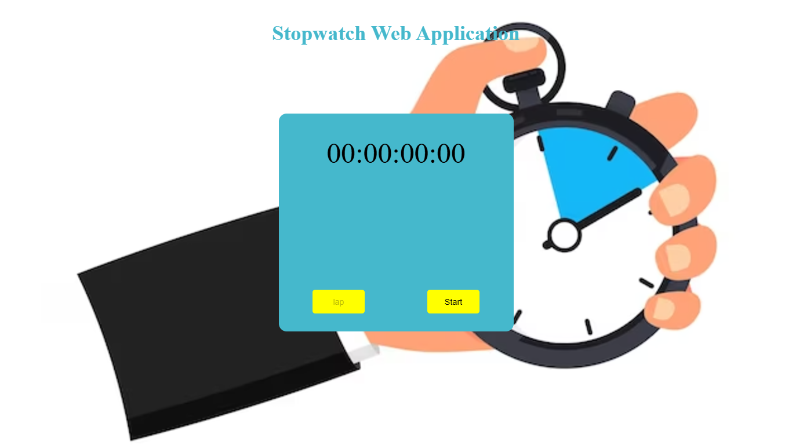

# StopWatch

### 🔗 **Live preview** of the project is [here](https://gowtham6477.github.io/PRODIGY_WD_01_Responsive_landing_page/).
A simple and interactive stopwatch application built with HTML, CSS, and JavaScript. The stopwatch can be used to track time for various activities, featuring start, stop, and reset functionalities.

## 🚀 Features

- **Start/Stop**: Toggle the stopwatch on or off..
- **Reset**: Reset the time to zero.
- **Time Display**: Real-time display of elapsed time in seconds and milliseconds.
- **Cross-Browser Compatibility**: Tested across major web browsers.
- **Laps**: Record and display lap times.

### **Outcome:**
- **HTML5**: Markup language for structuring the web page.
- **CSS3**: Styling and layout using responsive design principles.
- **JavaScript**: Interactive and dynamic functionalities.